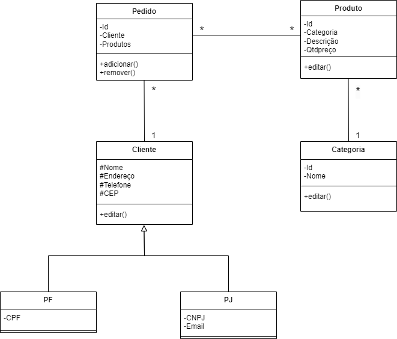

# Final Project: Back Office

A repository containing the final project for the Data Structure course.
All the reference material can be found in ["Data Structure [Portuguese]"](https://www.leandrocolevati.com.br/materiais?disciplina=4716-003).
Alternatively, a brief summary of the topics can be found in ["What is Data Structure [English]"](https://www.geeksforgeeks.org/what-is-data-structure-types-classifications-and-applications/)

**The documentation and project's instructions can be found in the resource folder.** 

## Description

A Back office is made up of personnel who support the operations of a company but do not directly interact with customers.
Back-office activities include managing inventory, processing sales orders and onboarding new employees.
For this, a simple system is developed to allow administrators and users to load a database (using .csv files) and manage all the company's daily activities. 

## Class Diagram



### Dependencies

* Java Development Kit (JDK).
* (Optional) IDE, such as VSCode, NetBeans or Eclipse.

### Folder Structure
````
Back Office
├── bin/
├── data/
│   ├── categorias.csv
│   ├── clientePF.csv
│   ├── clientePJ.csv
│   ├── pedidos.csv
│   ├── produtos.csv
├── lib/
│   ├── genericLinkedList.jar
│   ├── genericQueue.jar
│   ├── genericStack.jar
├── resources/
│   ├── diagramadeclasse.png
│   ├── instruções.pdf
├── src/
│   ├── controller/
│   │   ├── crud/
│   │   ├── login/
│   │   ├── salvarecarregar/
│   ├── model/
│   │   ├── Categorias.csv
│   │   ├── ClientePF.csv
│   │   ├── ClientePJ.csv
│   │   ├── Pedidos.csv
│   │   ├── Produtos.csv
│   ├── view/
│   │   ├── telascarregar
│   │   ├── telascompra
│   │   ├── telascrud
│   │   ├── telasmenu
│   │   ├── telassalvar
│   │   ├── Principal.java
├── .gitignore
├── LICENSE
└── README.md
````

### Executing program

* Each java file can be found in the "/src" folder.
* The Entry point (or main function) for the projects is the "Principal.java".

* Administrator's password: 0000

## Authors

 - deArruda, Lucas
 - Delfino, Gabriel Cavalcante
 - dos Santos, Rafael Bezerra
 - Severiano, Bianca
 - Silva, Pedro H. Barros

## Version History

* 0.8
    * Integration process.

## License

This project is licensed under the GPL-3.0 License - see the LICENSE.md file for details